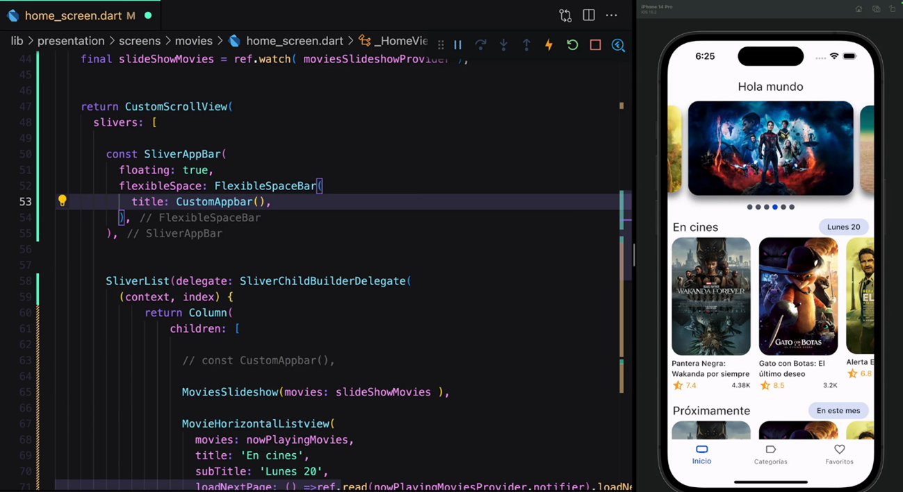

# Cinefy

Cinefy es una aplicación móvil desarrollada en Flutter y Dart que permite consultar información detallada sobre películas, utilizando la API de The MovieDB. Esta aplicación fue creada como proyecto para el curso de Computación Paralela y Distribuida.



## Características
- Búsqueda y exploración de películas populares
- Visualización de detalles, sinopsis y calificaciones
- Interfaz moderna y responsiva
- Consumo eficiente de la API de The MovieDB

## Tecnologías utilizadas
- Flutter
- Dart
- The MovieDB API

## Instalación
1. Clona este repositorio:
   ```bash
   git clone <url-del-repositorio>
   ```
2. Ingresa al directorio del proyecto:
   ```bash
   cd flutter-cinemapedia
   ```
3. Copia el archivo `.env.template` y renómbralo a `.env`:
   ```bash
   cp .env.template .env
   ```
4. Configura tus variables de entorno (API Key de The MovieDB) en el archivo `.env`.
5. Instala las dependencias:
   ```bash
   flutter pub get
   ```
6. Ejecuta la aplicación:
   ```bash
   flutter run
   ```

## Uso
- Navega por las películas populares desde la pantalla principal.
- Selecciona una película para ver sus detalles.

## Créditos
- Desarrollado por: [Tu Nombre Aquí]
- Curso: Computación Paralela y Distribuida
- API: [The MovieDB](https://www.themoviedb.org/)
